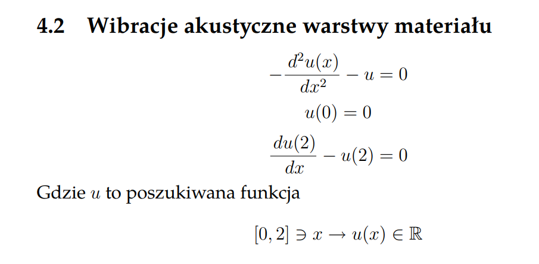
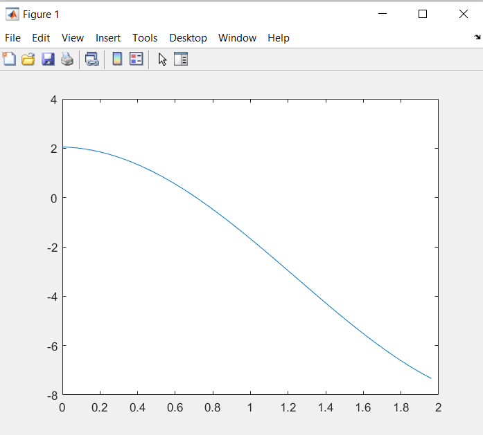

# Equation of acoustic vibrations of material layers

## Task
Main task this programme was to solve equation of acoustic vibrations of material layers, using finite element method. Given equation:

## Sample plot for 100 points

